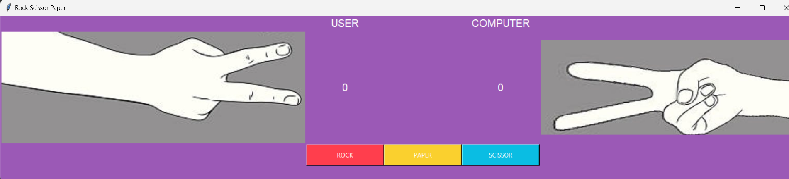
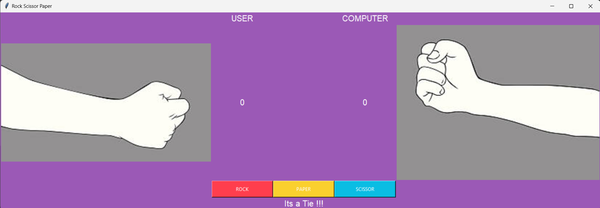
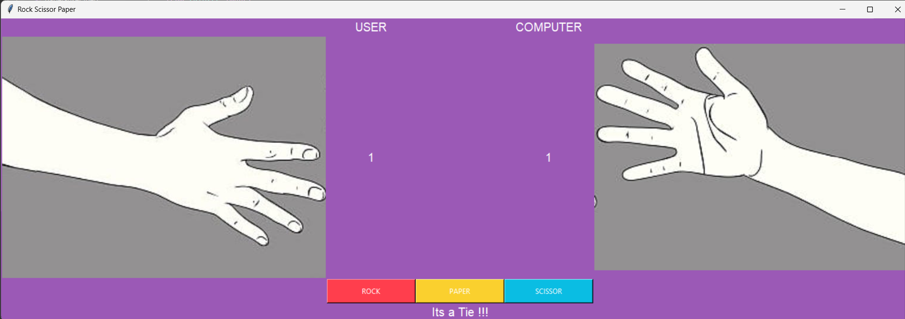
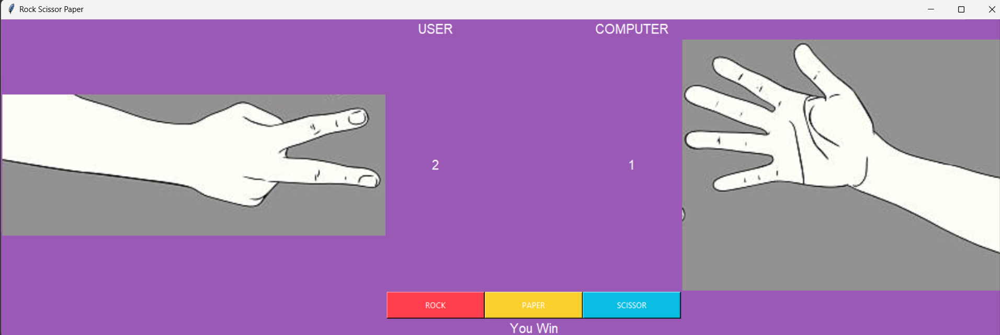

# 🪨Rock, 📃Paper, ✂️Scissors Game

This is a simple **Rock, Paper, Scissors** game implemented in **Python** using the **Tkinter** library for the GUI.

## 🧐 Description

This game allows the user to play **Rock, Paper, Scissors** against the computer. The user selects their choice (Rock, Paper, or Scissors) by clicking the corresponding button, and the computer randomly selects its move. The game then determines the winner based on the rules of **Rock, Paper, Scissors** and displays the result.

## 💻 Technology
- Python Programming Language
- Tkinter Library
- PIL (Python Imaging Library)

## 🚀 Features

- Simple and intuitive GUI using **Tkinter**.
- Random computer moves for unpredictability.
- Score tracking for both the user and computer.
- Real-time feedback on the game result.

## 💻 How to Run
1. Clone the repository or download the source code files.

2. Make sure you have **Python** installed on your system.

3. Install the required libraries using pip:
    ```bash
    pip install pillow

4. Open a terminal or command prompt and navigate to the project directory.

5. Run the following command to start the game:
    ```bash
    python main.py

6. The game window will open, allowing you to play **Rock, Paper, Scissors** against the computer.

## 📷 Screenshots
<div>
   <h2 align="center"></h2>
   <h2 align="center"></h2>
   <h2 align="center"></h2>
   <h2 align="center"></h2>
</div>

## 😀 Contributing
Pull requests are welcome. For major changes, please open an issue first to discuss what you would like to change.

### Show some ❤️ by starring some of the repositories!
